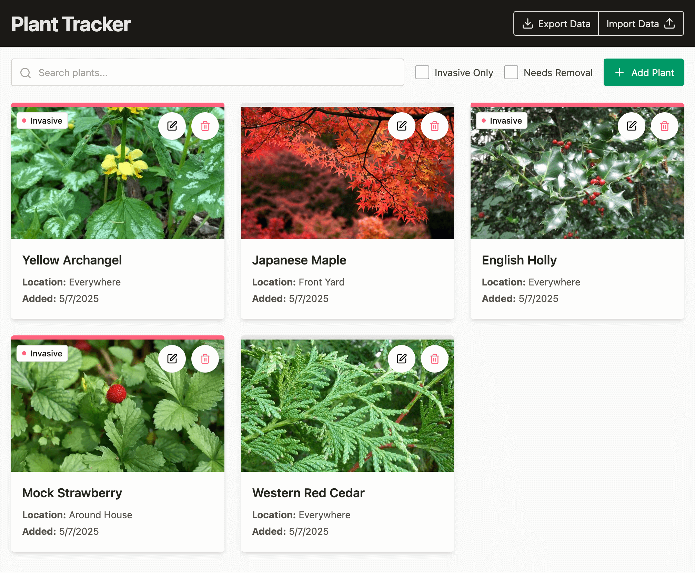

# Property Plant Tracker

A simple web application to track plants on your property, with features to identify invasive species and create a removal to-do list.



## Features

- 🌱 Add plants with names, locations, and images
- 🖼️ Upload and store plant images
- 🔍 Search and filter your plant collection
- ⚠️ Mark invasive species for easy identification
- ✅ Create to-do lists for plant removal
- 💾 Data stored locally in your browser
- 📤 Export/import data for backup

## How It Works

Property Plant Tracker is a client-side application that stores all your plant data directly in your browser's localStorage.

## Development

This project was built using:

- React for the UI components
- Tailwind CSS v4 for styling
- Vite as the build tool
- LocalStorage API for data persistence

### Building the Project

If you want to make changes to the project, you'll need to build it locally after cloning this repo:

1. Install dependencies:
   ```
   npm install
   ```

2. Run in development mode:
   ```
   npm run dev
   ```

3. Build for production:
   ```
   npm run build
   ```

The build process creates a `docs` folder that is used by GitHub Pages

### Deployment

This project is configured to deploy to GitHub Pages using the `docs` folder:

1. Build the project: `npm run build`
2. Commit the changes including the `docs` folder
3. Push to GitHub
4. Ensure your GitHub Pages settings are enabled and configured to use the `docs` folder
